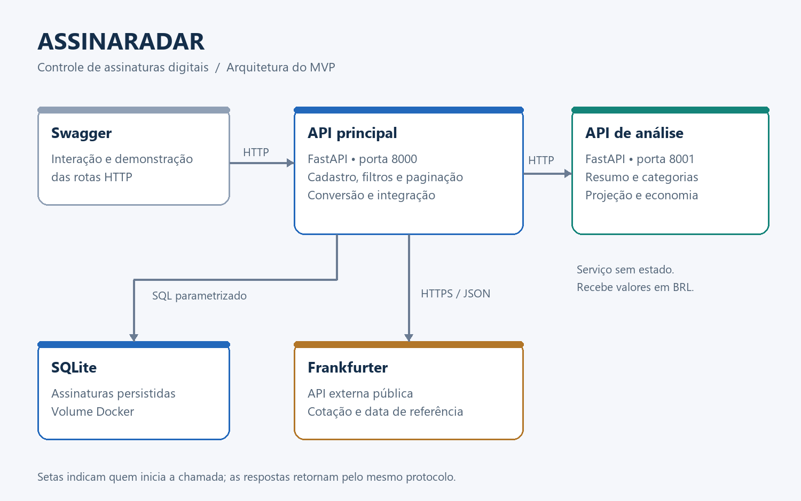

# AssinaRadar — API de assinaturas

API REST em Python para controlar assinaturas de serviços digitais. Persiste os cadastros em SQLite, consulta cotações externas e envia os valores normalizados à API de análise.

## Arquitetura



O usuário interage pelo Swagger. A API principal mantém os dados, consulta a Frankfurter por HTTPS e chama a API secundária por HTTP/JSON. A secundária calcula resultados sem acessar o banco nem a API externa. Não existe redirecionamento para outro aplicativo.

## Pré-requisitos

- Python 3.12 para execução local.
- Docker com Compose para execução em contêineres.
- Acesso à internet para instalar dependências e consultar moedas estrangeiras.
- A pasta/repositório `assinaradar-analytics` ao lado deste para usar o Compose.

## Execução com Docker

Estrutura esperada após clonar os dois repositórios:

```text
projetos/
  assinaradar-api/
    compose.yaml
    Dockerfile
  assinaradar-analytics/
    Dockerfile
```

Na raiz deste repositório:

```powershell
docker compose up --build -d
docker compose ps
docker compose logs api analytics
```

Abra http://localhost:8000/docs e http://localhost:8001/docs. O volume `assinaradar_data` preserva o banco entre reinicializações. Para encerrar sem apagar dados:

```powershell
docker compose down
```

As portas são publicadas apenas na máquina local. O Compose espera a API de análise ficar saudável antes de iniciar a principal. O arquivo está na raiz deste componente, conforme o enunciado.

## Execução local

Abra um terminal nesta pasta. No Windows/PowerShell:

```powershell
python -m venv .venv
.venv\Scripts\python -m pip install -r requirements.txt
$env:ANALYTICS_URL = "http://127.0.0.1:8001"
.venv\Scripts\python -m uvicorn app.main:app --host 127.0.0.1 --port 8000
```

Em Linux/macOS, use `.venv/bin/python` e `export ANALYTICS_URL=http://127.0.0.1:8001`. Inicie a API secundária em outro terminal seguindo seu README.

| Variável | Padrão local | Uso |
| --- | --- | --- |
| `DATABASE_PATH` | `data/assinaradar.db` | Caminho do SQLite, criado na inicialização |
| `ANALYTICS_URL` | `http://127.0.0.1:8001` | Endereço interno da API de análise |

Não há chave de API ou cadastro obrigatório. Não é necessário criar um arquivo `.env`; as variáveis são lidas do ambiente.

## Rotas

| Método | Rota | Função |
| --- | --- | --- |
| POST | `/assinaturas` | Cadastrar assinatura; retorna 201 |
| GET | `/assinaturas` | Listar com categoria, ativo, ordem, limite e offset |
| PUT | `/assinaturas/{assinatura_id}` | Substituir todos os dados; `ativo=false` cancela no cadastro |
| DELETE | `/assinaturas/{assinatura_id}` | Excluir; retorna 204 |
| GET | `/cotacoes/{moeda}` | Consultar taxa de referência para BRL |
| GET | `/analises/{tipo}` | Resumo, categorias, projeção ou economia |

O endpoint operacional `/health` não conta como rota de negócio e está oculto no Swagger. O esquema OpenAPI fica em `/openapi.json`.

### Exemplo de cadastro

```json
{
  "nome": "Armazenamento em nuvem",
  "categoria": "Produtividade",
  "valor": "29.90",
  "moeda": "BRL",
  "periodicidade": "mensal",
  "proxima_cobranca": "2026-10-10",
  "ativo": true
}
```

Moedas aceitas: BRL, USD, EUR e GBP. Periodicidades: mensal e anual. Valores devem ser positivos, ter até duas casas decimais e ser no máximo 1.000.000 na moeda original. As categorias são normalizadas em minúsculas. Nomes e categorias em branco, datas inválidas e campos desconhecidos são recusados com 422.

O valor original é salvo em centavos inteiros. Respostas monetárias usam strings decimais; `29.9` e `29.90` representam o mesmo valor. O arredondamento das conversões usa `ROUND_HALF_UP` para centavos.

### Funcionalidades além do CRUD

- Filtros por categoria e situação; paginação de 1 a 100 registros por página.
- Ordenação por nome ou próxima cobrança, com desempate pelo ID.
- Custo mensal equivalente e anual de todas as assinaturas ativas, sem o limite da página de listagem.
- Distribuição por categoria e projeção de 1 a 60 meses.
- Simulação de cancelamento: `/analises/economia?excluir_ids=1&excluir_ids=2`.

A simulação não altera cadastros. IDs inexistentes ou inativos são recusados. O PUT com `ativo=false` apenas registra o cancelamento no AssinaRadar: não cancela contratos com fornecedores.

## API externa

Serviço: **Frankfurter**, https://frankfurter.dev/.

- Serviço público gratuito, sem cadastro e sem chave na instância pública.
- Rota utilizada: `GET https://api.frankfurter.dev/v2/rate/{moeda}/brl`, com moeda minúscula (usd, eur ou gbp).
- O código do serviço usa licença MIT: https://github.com/lineofflight/frankfurter/blob/main/LICENSE.
- A licença MIT do software não substitui os termos dos provedores das cotações; consulte as condições indicadas na documentação: https://frankfurter.dev/.
- BRL/BRL usa paridade 1 local, sem acesso externo.
- A data da taxa é devolvida ao usuário. São cotações de referência, não preços em tempo real nem o valor efetivamente cobrado pelo cartão.

Somente o par de moedas é enviado ao serviço externo. Não são enviados nomes ou valores das assinaturas. Uma moeda é consultada apenas uma vez por análise. O sistema não guarda cache de câmbio; timeouts, falhas HTTP e respostas inválidas resultam em 502, sem substituir a cotação por um valor inventado.

## Regras da análise

Somente assinaturas ativas participam dos cálculos. O custo anual é dividido por 12 para encontrar seu equivalente mensal. A projeção mantém preços e câmbio constantes, sem IOF, impostos, juros ou reajustes. `proxima_cobranca` é um campo de organização: não avança automaticamente e não transforma a projeção em calendário de caixa.

## Testes

```powershell
.venv\Scripts\python -m pip install -r requirements-dev.txt
.venv\Scripts\python -m pytest -q
```

Os testes usam banco temporário e respostas externas controladas para verificar regras e falhas de comunicação. Não dependem de internet. Consulte [validação](docs/validacao.md) para distinguir testes automatizados de execução em Docker.

## Organização

```text
app/main.py       Rotas, inicialização e configuração
app/models.py     Contratos e validação
app/database.py   Persistência SQLite parametrizada
app/services.py   Integrações HTTP e conversão
tests/            Testes de comportamento
docs/             Arquitetura, demonstração e entrega
Dockerfile        Imagem do componente
compose.yaml      Execução dos dois serviços
```

É um MVP local de usuário único, sem autenticação. A publicação em ambiente multiusuário exigiria autenticação e isolamento dos registros.
